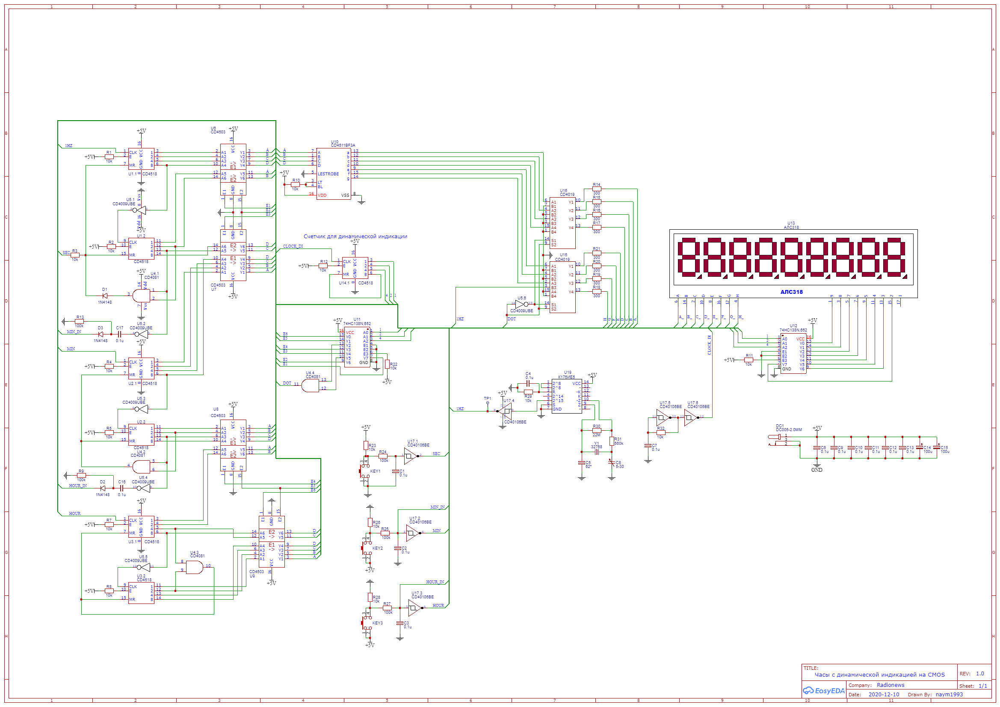

# cmos_clock
Проект часов на дискретной КМОП логике.

[Проект в среде EasyEDA](https://oshwlab.com/naym1993/cmos_clock "Ссылка на проект")

Принципиальная схема:

Всем спасибо за поддержку проекта!
